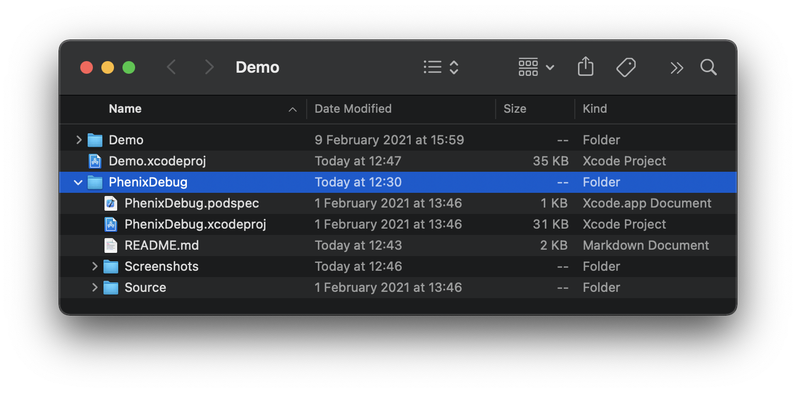
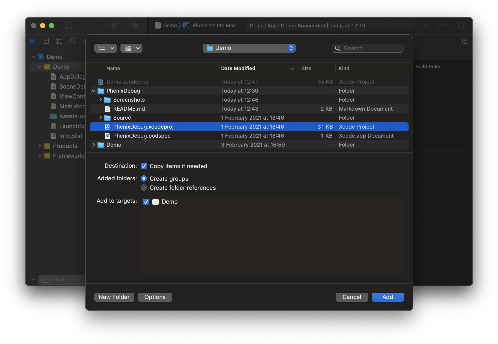
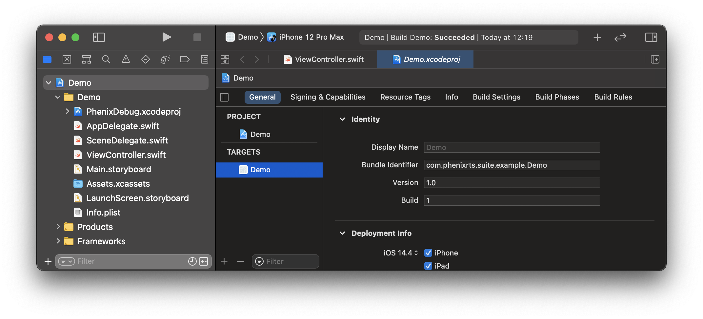
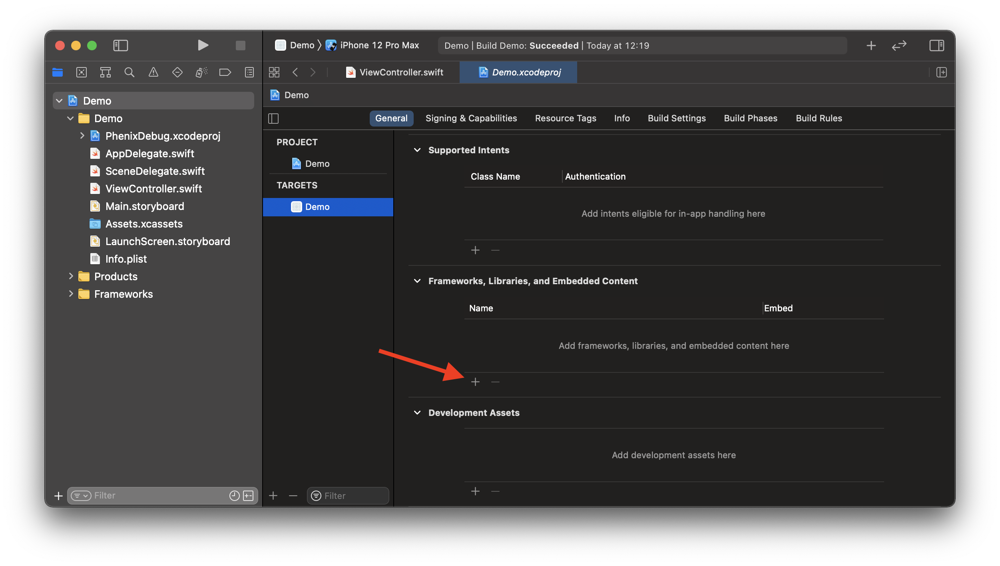
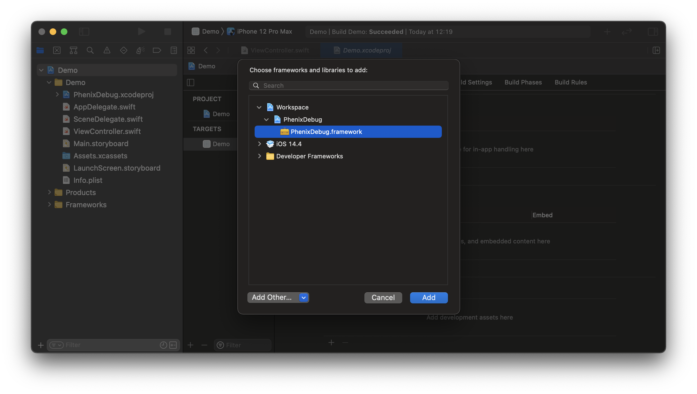

# Phenix Debug

Support framework providing necessary functionality to show debug view which displays the app
and the `PhenixSdk` versions and shares run-time logs from the SDK.

## Requirements
* iOS 13.0+
* Xcode 12.5.1+
* Swift 5.4+
* PhenixCore framework

## Installation

### CocoaPods (using Development Pods)

[CocoaPods](https://cocoapods.org) is a dependency manager for Swift and Objective-C Cocoa projects.
For usage and installation instructions, visit their website.

To integrate `PhenixDebug` into your Xcode project using CocoaPods:

1. Move `PhenixDebug` directory inside your iOS project root directory.

2. Modify your `Podfile`:

```ruby
target 'your app name'
  use_frameworks!
  pod 'PhenixCore', :path => 'path/to/PhenixCore'
  pod 'PhenixDebug', :path => './PhenixDebug'
end
```

3. Install `Podfile` dependencies:

```shell
foo@bar Demo % pod install
```

### Manually

1. Move `PhenixDebug` directory inside your iOS project root directory.



2. Open your project.

3. Select the root node of your project.


4. Select `File - Add Files to “{your project name}”...` from the macOS status bar (while Xcode is focused).

5. In the file chooser, navigate to the `PhenixDebug` and select `PhenixDebug.xcodeproj`.
Then click *Add* to add it as a sub-project.



6. Select the top level node of your project to open the project editor,
click the main app target and then go to the General tab.



7. Scroll down to the `Frameworks, Libraries and Embedded Content` section.

8. Click on the + button to select and add a new framework or library.



9. Search for the `PhenixDebug.framework`, select it and click *Add* to embed into your project.



## Usage

1. In the view controller `viewDidLoad()` method, add a tap gesture to the view:

```swift
import PhenixDebug
import PhenixSdk
import UIKit

class ViewController: UIViewController {
    @IBOutlet private var contentView: UIView!

    override func viewDidLoad() {
        // other code

        // Configure tap gesture to open debug menu, when user taps 5 times on the contentView.
        let tapGesture = UITapGestureRecognizer(target: self, action: #selector(contentViewTappedMultipleTimes))
        tapGesture.numberOfTapsRequired = 5
        contentView.addGestureRecognizer(tapGesture)
    }
}
```

2. Create a method for showing the `PhenixDebugViewController` in the same view controller
where you added the tap gesture:

```swift
import PhenixDebug
import PhenixSdk
import UIKit

class ViewController: UIViewController {
    var core: PhenixCoreDebuggable! // previously obtained

    @objc func contentViewTappedMultipleTimes() {
        let viewModel = DebugViewController.ViewModel(core: core)
        let vc = DebugViewController(viewModel: viewModel)
        present(vc, animated: true)
    }
}
```
