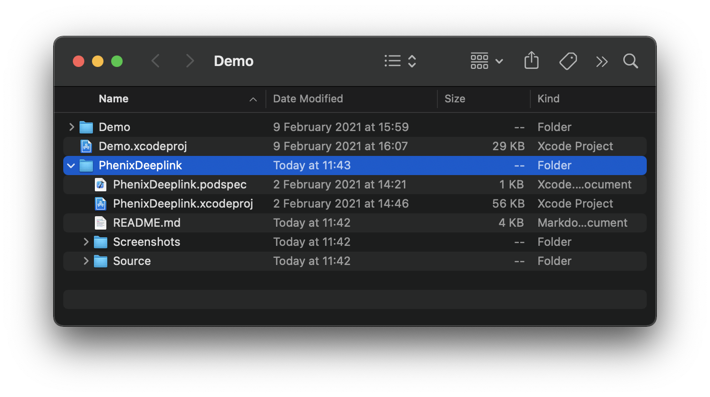
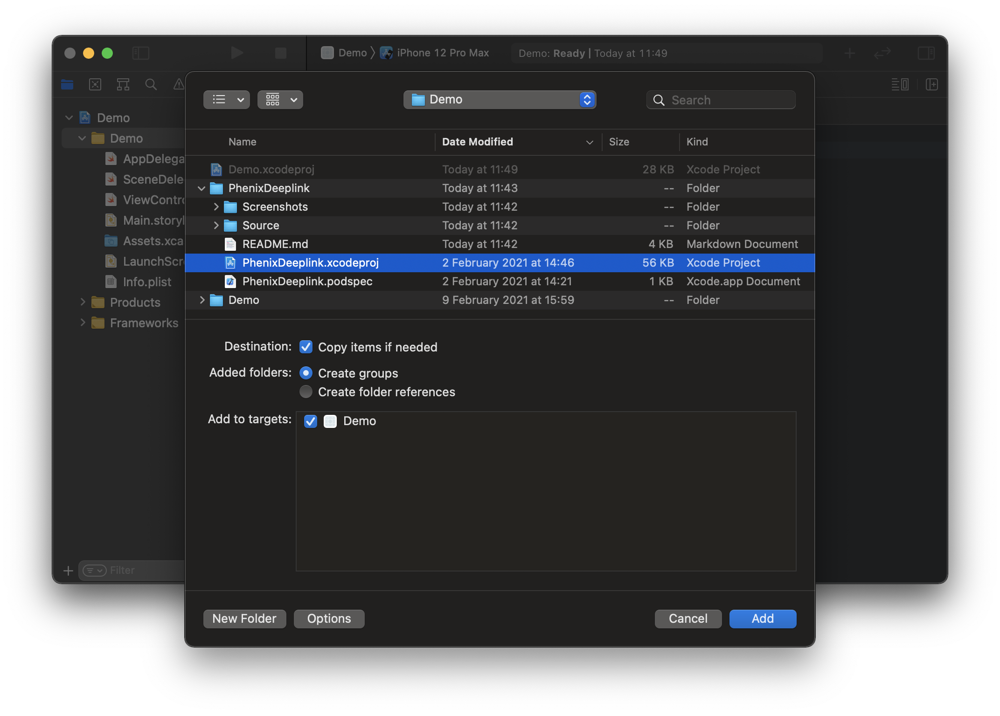
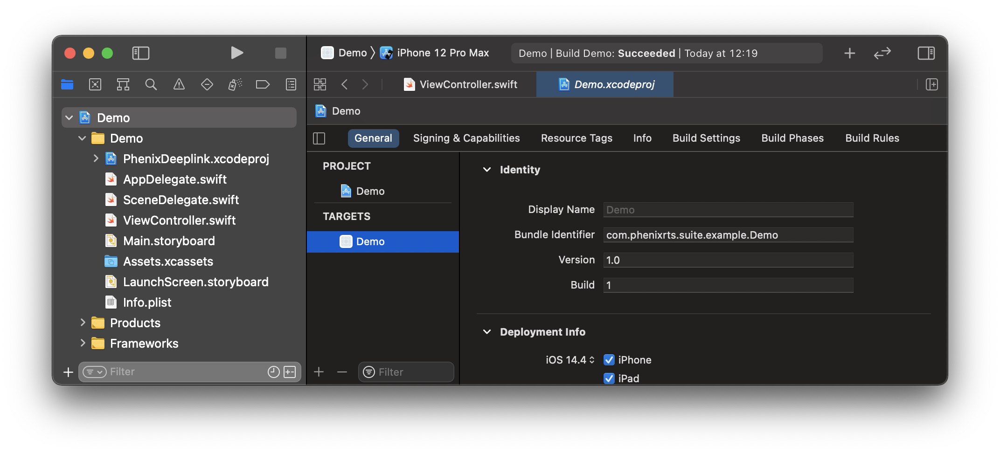
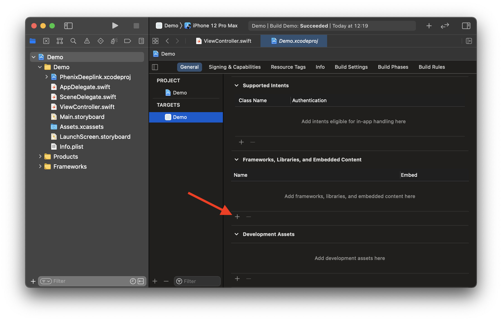
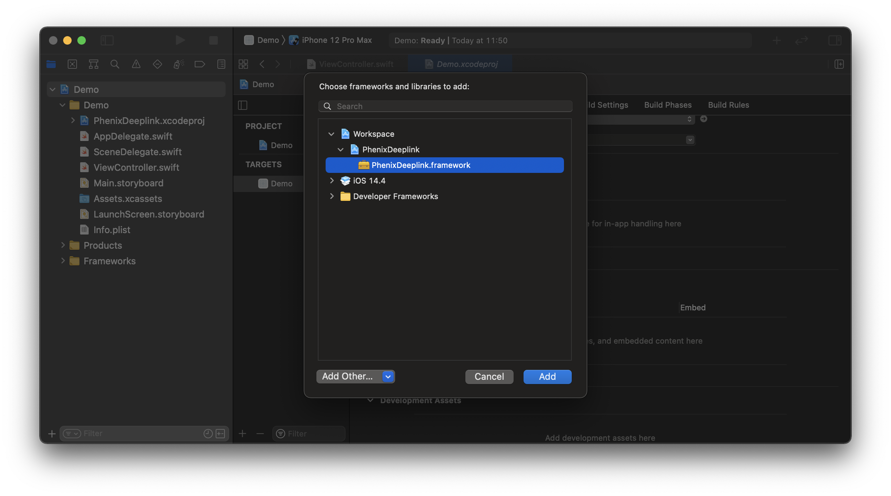

# Phenix Deeplink

Support framework providing necessary functionality to parse deep links.

## Requirements
* iOS 13.0+
* Xcode 12.5.1+
* Swift 5.4+
* PhenixCore framework

## Installation

### CocoaPods (using Development Pods)

[CocoaPods](https://cocoapods.org) is a dependency manager for Swift and Objective-C Cocoa projects.
For usage and installation instructions, visit their website.

To integrate `PhenixDeeplink` into your Xcode project using CocoaPods:

1. Move `PhenixDeeplink` directory inside your iOS project root directory.

2. Modify your `Podfile`:

```ruby
target 'your app name'
  use_frameworks!
  pod 'PhenixDeeplink', :path => './PhenixDeeplink'
end
```

3. Install `Podfile` dependencies:

```shell
foo@bar Demo % pod install
```

### Manually

1. Move `PhenixDeeplink` directory inside your iOS project root directory.



2. Open your project.

3. Select the root node of your project.


4. Select `File - Add Files to “{your project name}”...` from the macOS status bar (while Xcode is focused).

5. In the file chooser, navigate to the `PhenixDeeplink` and select `PhenixDeeplink.xcodeproj`.
Then click *Add* to add it as a sub-project.



6. Select the top level node of your project to open the project editor,
click the main app target and then go to the General tab.



7. Scroll down to the `Frameworks, Libraries and Embedded Content` section.

8. Click on the + button to select and add a new framework or library.



9. Search for the `PhenixDeeplink.framework`, select it and click *Add* to embed into your project.



## Usage

1. Choose which deep link model to use.

1.1. Use default deep link model `PhenixDeeplinkModel`,
which contains all the possible deep link properties, like, `authToken`, `publishToken`, etc.

1.2. Create a new custom deep link model, which will know how to parse the provided URL parameters.
This model must conform to the `PhenixDeeplinkUrlModelRepresentable` protocol.

Here is an example of custom deep link model for URL like  `https://{host}?token=DIGEST:eyJhcHBsaWNhdGlvb#test`:

```swift
import PhenixDeeplink

struct CustomDeeplinkModel: PhenixDeeplinkUrlModelRepresentable {
    let alias: String?
    let token: String?

    init?(components: URLComponents) {
        self.alias = components.fragment

        if let string = components.queryItems?.first(where: { $0.name == "token" })?.value {
            self.token = string
        }
    }
}
```

2. In the *AppDelegate.swift*, import the `PhenixDeeplink` framework

```swift
import PhenixDeeplink
```

3. In the *AppDelegate.swift*, inside the method `func application(_:continue:restorationHandler:) -> Bool`
make a deep link model instance:

3.1. Using default deep link model:

```swift
func application(_ application: UIApplication, continue userActivity: NSUserActivity, restorationHandler: @escaping ([UIUserActivityRestoring]?) -> Void) -> Bool {
    guard let model: PhenixDeeplinkModel = PhenixDeeplink.makeDeeplink(userActivity) else {
        return false
    }

    // Provide the deep link model to your application.

    return true
}
```

3.2. Using custom deep link model:

```swift
func application(_ application: UIApplication, continue userActivity: NSUserActivity, restorationHandler: @escaping ([UIUserActivityRestoring]?) -> Void) -> Bool {
    guard let model: CustomDeeplinkModel = PhenixDeeplink.makeDeeplink(userActivity) else {
        return false
    }

    // Provide the deep link model to your application.

    return true
}
```

## Debugging

For easier debugging, you can use the Xcode environment to inject a deep link URL.

1. In *AppDelegate.swift*, add code to generate deep link model out of the environment variable:

```swift
func application(_ application: UIApplication, didFinishLaunchingWithOptions launchOptions: [UIApplication.LaunchOptionsKey: Any]?) -> Bool {
    // other code

    // Run this only in debug mode.
    #if DEBUG
    // Make deep link model out of the environment variable.
    if let model: PhenixDeeplinkModel = PhenixDeeplink.makeDeeplinkFromEnvironment() {
        // Provide the deep link model to your application.
    }
    #endif

    return true
}
```

2. Select *Product - Scheme - Edit Scheme* from Xcode's menu bar.

3. Open *Run - Arguments* tab.

4. Under the *Environment Variables*:

4.1. add a new variable with key `PHENIX_DEEPLINK_URL`,

4.2. add deep link URL as the value for the previously provided key (it must be a valid URL including the *http* at the beginning).

5. Close the scheme window.

6. Build and run the application.

After these steps, each time the application will be launched from Xcode, it will use the injected deep link URL.
If the application will be launched manually by tapping on the app icon in the device/simulator,
it will not use the Xcode environments and will open normally.
