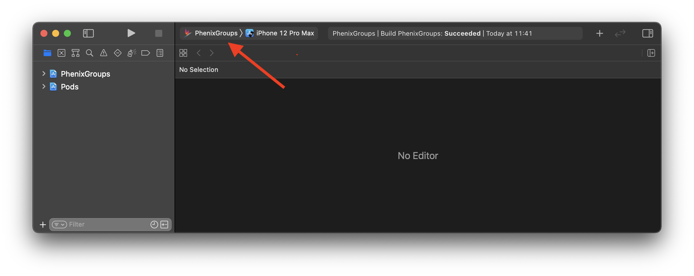
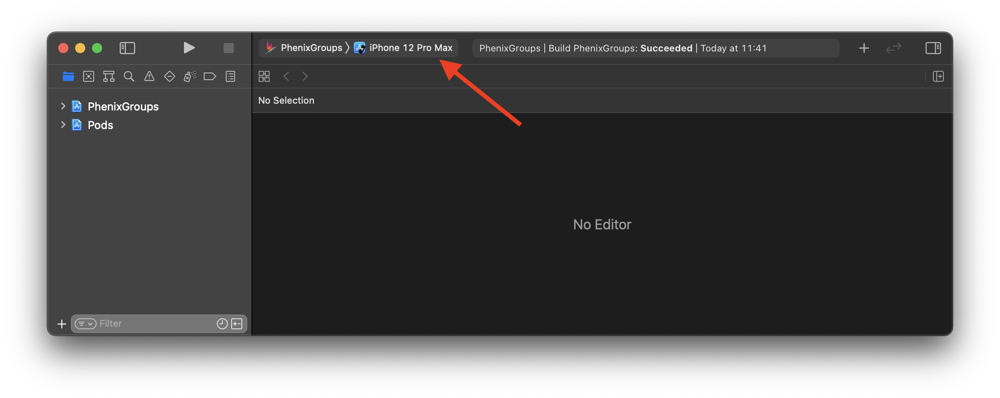
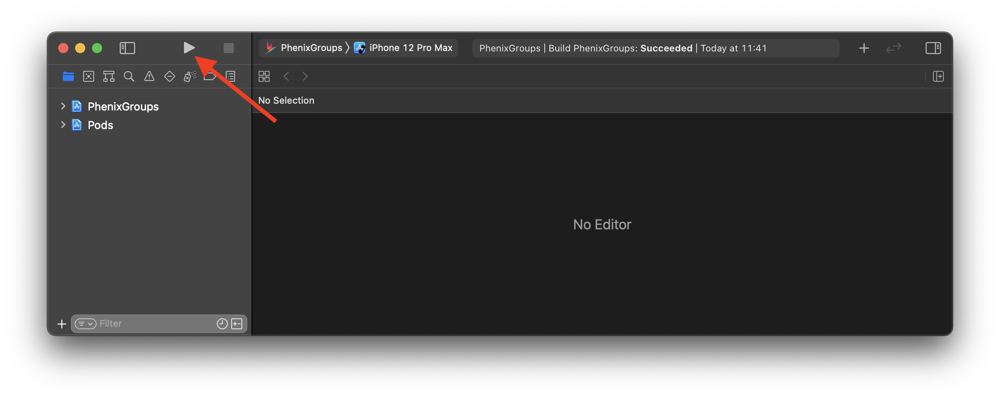

# Phenix Groups

## Requirements
* iOS 12.0+
* Xcode 11+
* Swift 5.1+

## Build
*(Commands must be executed from the project's **root** directory)*

1. Install [Bundler](https://bundler.io) using Terminal:
```
gem install bundler
```

2. Install project environment dependencies listed in [Gemfile](/iOS/PhenixGroups/Gemfile):
```
bundle install
```
This will install a specific version of the [CocoaPods](https://cocoapods.org), dependency management tool, which this project uses to link 3rd party libraries.

3. Install project dependencies listed in [Podfile](/iOS/PhenixGroups/Podfile):
```
bundle exec pod install
```

## Run Project

1. Open `PhenixGroups.xcworkspace`

2. Set schema to `PhenixGroups`:



3. Select the desired device (Simulator or Physical device):



4. Press _Run_:


## Deep-links

Application can be opened using a deep-link together with configuration parameters.
Deep-link examples:

* `https://phenixrts.com/group/#abc-cdef-ghi`
* `https://phenixrts.com/group/?uri=https://phenixrts.com&backend=https://demo.phenixrts.com/pcast&maxVideoMembers=4#abc-cdef-ghi`

### Deep-link parameters

* `uri` - Phenix PCast url.
* `backend` - Phenix backend url.
* `maxVideoMembers` - Maximum member count which can subscribe to a room with video.
* `#xxx-xxxx-xxx` - Phenix room alias.

## Debug menu

To open a debug menu, tap 5 times quickly on the camera surface view in the application.
